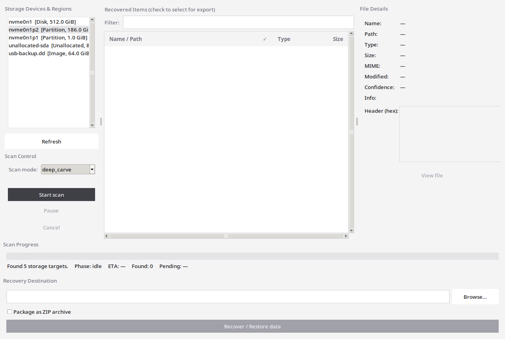
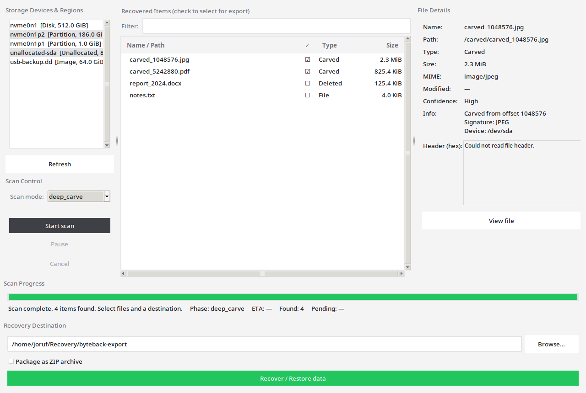
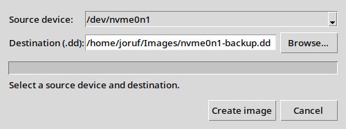

# ByteBack v2.0

**ByteBack** is a Linux data recovery tool with a graphical user interface. It enumerates disks, partitions, disk images, and unallocated space; performs deep scans including ext4 deleted-file recovery; and lets you export selected items to a folder or ZIP archive.

## Screenshots

### Main window

Select a disk, partition, image, or unallocated region and choose a scan mode.



### Scan results

Review carved and deleted files, inspect details, and export selected items.



### Disk image dialog

Create a verified raw ``.dd`` image before scanning a source device.



## Features

- **Device discovery** – lists block devices, partitions, loop devices, unallocated gaps, and saved disk images
- **Disk imaging** – create verified raw ``.dd`` images before analysis (Tools → Create disk image)
- **Scan modes**
  - **auto** – filesystem inventory on mounted partitions, ext4 deleted scan elsewhere
  - **filesystem** – inventory existing files on mounted partitions
  - **ext4_deleted** – recover deleted files via ext4 inode metadata (real deleted-file recovery)
  - **free_space** – carve signatures only from unallocated ext4 blocks
  - **deep_carve** / **quick_carve** – signature carving on raw/unallocated regions
- **Format validation** – carved files validated via format-specific parsers
- **Result filter** – search by name, path, type, or signature
- **Hex header preview** – inspect file headers in the details panel
- **Pause / Resume** – persists state to ``~/.local/share/byteback/``
- **Recovery export** – copy selected files or ZIP archive

## Project Structure

```
byteback/
├── run.py                      # Launcher
├── main.py                     # Application entry
├── config/                     # App, scan, signature, and path settings
├── models/                     # Domain models (entries, targets, disk images)
├── services/
│   ├── carving/                # Signature carving + format parsers
│   ├── scanning/               # Filesystem scan, strategy, executor
│   ├── filesystems/ext4/       # ext4 deleted inode + free-space scanners
│   ├── imaging/                # Disk image writer + registry
│   ├── device_scanner.py
│   ├── scan_worker.py
│   └── recovery_exporter.py
├── ui/                         # Tkinter interface + theme
├── utils/                      # Helpers
├── assets/                     # Icons and desktop entries
├── docs/
│   └── screenshots/            # README screenshots
├── scripts/
│   ├── build_icons.sh          # Regenerate PNG icons from SVG
│   └── generate_screenshots.py # Regenerate README screenshots
└── tests/                      # 85+ unit/integration tests
```

## Requirements

- Linux with `lsblk` (util-linux)
- `parted` (recommended, for unallocated region detection)
- `mkfs.ext4` and `debugfs` (optional, for ext4 recovery tests)
- Python 3.10+ with `tkinter` (`python3-tk` on Debian/Ubuntu/Mint)
- Optional: `python3-magic` for improved MIME detection
- `polkit` (`pkexec`) for the one-time administrator prompt at startup
- Optional: ImageMagick ``import`` or ``scrot`` (only needed to regenerate README screenshots)

## Installation

Optional desktop install (launcher, icon, menu entry):

```bash
git clone https://github.com/joruf/byteback.git
cd byteback
chmod +x install.sh
./install.sh
```

This installs to `~/.local/share/byteback`, creates `~/.local/bin/byteback`, and registers a desktop starter.

System-wide: `sudo ./install.sh --system`

## Usage

```bash
git clone https://github.com/joruf/byteback.git
cd byteback
chmod +x run.py
./run.py
```

ByteBack starts a small pkexec helper once at launch (same pattern as Shredder). After authentication, disk scans and imaging use that helper without further prompts.

### Workflow

1. Optionally **Tools → Create disk image (.dd)** to image the source device first
2. Select a disk, partition, image, or unallocated region
3. Choose scan mode (`ext4_deleted` for deleted files, `free_space` for unallocated blocks)
4. **Start scan** → check results → choose destination → **Recover / Restore data**

## Tests

```bash
python3 -m venv .venv
.venv/bin/pip install -r requirements-dev.txt
.venv/bin/pytest -v
```

## Regenerating screenshots

```bash
python3 scripts/generate_screenshots.py
```

Requires a running X11/Wayland session and ``import`` (ImageMagick) or ``scrot``.

## Important Notes

- ByteBack performs **read-only** access to storage devices during scanning
- Always recover data to a **different disk** than the source device

## License

MIT
